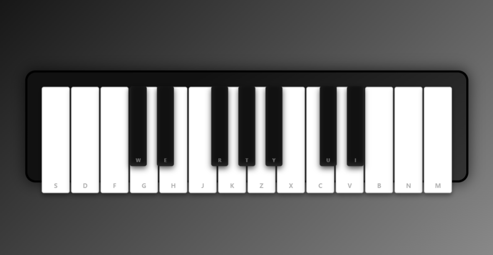

# 🎹 HTML Casio Keyboard 🎶

Welcome to my very first full project using only **HTML**, **CSS**, and **JavaScript** — presenting a **virtual Casio keyboard** you can actually play! 👶💻

[🔗 Try it Live Here](https://shritij26.github.io/html-casio-keyboard/)

---

## ✨ Features

- 🎵 **Playable piano keys** (click or press on-screen)
- 🎨 **Styled like a real Casio** — keys, layout, and all!
- 🔊 **Realistic sound effects** (your neighbors will love it... maybe)
- 🌈 **Responsive design** — works on desktops and laptops!
- ⚡ **Pure Frontend** — no frameworks, no backend, no nonsense.

---

## 🤹‍♂️ Fun Facts

- This is my **first ever web project** built fully with **HTML + CSS + JS**.
- I hand-coded every key like a proud musician tunes their piano. 🛠️🎼
- The hardest part? Making sure every note *sounds good* without waking the whole house.
- Total number of Ctrl+Z: probably more than the number of keys on a real Casio.

---

## 🚀 How to Use

Just click the link 👉 [https://shritij26.github.io/html-casio-keyboard](https://shritij26.github.io/html-casio-keyboard)  
Then go full *Sa Re Ga Ma Pa* mode — no judges, just vibes. 🎶😎

---

## 📁 Tech Stack

- HTML  
- CSS  
- JavaScript  
- Passion and a bit of YouTube tutorials 🙃

---

## 📸 Screenshot

---

## 😂 What I Learned

- `position: absolute` has **trust issues**. It never stays where I expect it to.  
- CSS makes you feel powerful… until one `margin` breaks the entire layout.  
- JS event listeners are like clingy friends — always watching.  
- Sometimes fixing a bug just means deleting a line and pretending it was never there.  
- Turns out, making a keyboard is more fun than actually *learning* how to play one. 😅  
- But honestly, I learned **how to bring ideas to life** using nothing but HTML, CSS, and JS — and that’s kind of cool, right?

---

> _"Why play a real Casio when you can build one yourself?"_

